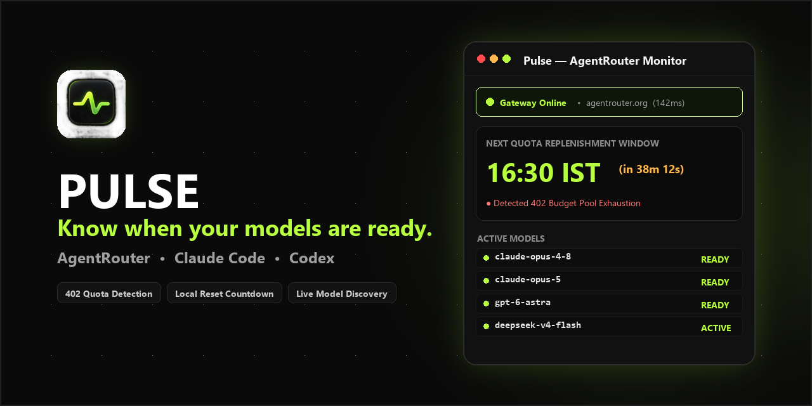

# PULSE

> **Know when your models are ready.**

[-B8FF3D?style=flat-square&logo=windows&logoColor=0A0A0A&labelColor=111111)](https://github.com/MrTG1B/Pulse/releases/download/v1.0.0/Pulse.exe)
[](https://github.com/MrTG1B/Pulse/releases/latest)
[](https://agentrouter.org)
[-0078D6?style=flat-square&logo=windows)](https://github.com/MrTG1B/Pulse/releases/latest)
[](LICENSE)
[](tests)

[ **Download for Windows** ](https://github.com/MrTG1B/Pulse/releases/download/v1.0.0/Pulse.exe) • [ **User Guide** ](docs/USER_GUIDE.md) • [ **Security Policy** ](docs/SECURITY.md) • [ **GitHub Release** ](https://github.com/MrTG1B/Pulse/releases/tag/v1.0.0)



**Pulse** monitors AgentRouter availability for developers using **Claude Code** and **Codex**.

```text
┌───────────────────────────────────────────────┐
│ ● Claude Opus 4.8                             │
│   AVAILABLE                                   │
│                                               │
│ Next quota window                             │
│ 16:30 IST                                     │
│                                               │
│ GPT-6 Astra                   ● AVAILABLE     │
└───────────────────────────────────────────────┘
```

### Stop checking AgentRouter manually.
Getting **`402 Budget pool quota has been exhausted`** on AgentRouter?  
Pulse watches model availability, quota replenishment windows, and gateway connectivity so you know the exact minute Claude and GPT are ready to code.

---

## ⚡ Why Pulse?

When you're building with **Claude Code**, **Codex**, or AgentRouter API tokens, shared budget pools run dry during peak hours. Manually sending test prompts or refreshing status dashboards wastes time and disrupts your coding flow.

Pulse runs as a lightweight, always-on-top desktop widget that sits alongside your IDE or terminal. It continuously tracks model health, calculates the exact countdown to the next quota drop in your local timezone, and alerts you the moment capacity is restored.

### Features
- **AgentRouter Availability Monitoring**: Real-time HTTP health and latency tracking directly against `agentrouter.org`.
- **HTTP 402 Quota Detection**: Instantly recognizes budget pool exhaustion and provides 1-click fallback to uninterrupted models.
- **Local Timezone Countdown**: Precision countdown tickers to official drop batches (`07:30 AM` and `04:30 PM IST` / `02:00` and `11:00 UTC`).
- **Compatible AgentRouter Client Headers**: Uses authentic client identification profiles (`claude-cli/1.0.108`) to ensure seamless interoperability for Claude Code and Codex workflows.
- **Dynamic Model Discovery**: Auto-detects all available models on your account token with live response time benchmarks.
- **Hardware-Backed Key Encryption**: Protects API keys at rest using **Windows DPAPI** (`CryptProtectData`). Plaintext keys are never stored on disk.
- **Always-on-Top Floating Widget**: Sleek, distraction-free desktop window with a 1-click compact mini-dock mode.

---

## 🔄 The Quota Lifecycle Flow

```
402 QUOTA EXHAUSTED  ──>  Countdown to Next Window (07:30 / 16:30 IST)  ──>  🔔 Chime Alert  ──>  🟢 AVAILABLE (200 OK)
```

1. **Detection**: AgentRouter returns `HTTP 402 Budget pool quota has been exhausted`.
2. **Countdown**: Pulse calculates the exact time remaining until the next replenishment window:
   - **Morning Batch**: `10:00 AM Beijing` (02:00 UTC / `07:30 AM IST`)
   - **Evening Batch**: `07:00 PM Beijing` (11:00 UTC / `04:30 PM IST`)
3. **Notification**: Audio chime sounds when the replenishment window opens.
4. **Availability**: Live diagnostic confirms `HTTP 200 OK` — your models are immediately ready for Claude Code and Codex tasks.

---

## 🔍 Solving Common AgentRouter Issues

| Issue / Search Query | What It Means | How Pulse Solves It |
|---|---|---|
| **`402 Budget pool quota has been exhausted`** | The shared Claude / GPT pool has reached its daily limit. | Tracks the exact countdown until quota resets; provides 1-click switch to `deepseek-v4-flash`. |
| **`401 unauthorized client detected`** | Gateway rejected unrecognized or bare HTTP headers. | Automatically sends authentic, compatible client headers (`claude-cli/1.0.108`). |
| **`503 no available channel in group`** | Model is not routed in your token's assigned channel group. | Identifies active channel models (`deepseek-v4-flash`) and provides live model discovery. |
| **AgentRouter Claude Code connectivity** | CLI coding tools fail silently during pool outages. | Float Pulse next to VS Code / terminal to know when Claude is ready before running commands. |

---

## 📦 Download & Quick Start

### Option 1: Standalone Windows App (No Python Needed)
1. Download **[Pulse.exe (v1.0.0)](https://github.com/MrTG1B/Pulse/releases/download/v1.0.0/Pulse.exe)** (31.5 MB).
2. Double-click to launch. No installer, no terminal window, no dependencies.
3. Click **Enter Key** in the top bar to paste your AgentRouter API key (`sk-...`).

### Option 2: Run from Python Source
```powershell
# 1. Clone the repository
git clone https://github.com/MrTG1B/Pulse.git
cd Pulse

# 2. Install dependencies
pip install -r requirements.txt

# 3. Launch the desktop widget
python app.py

# Or launch in web browser mode
python app.py --browser
```

---

## 🔒 Security & Key Protection

Pulse is designed with zero-telemetry and local-first security principles:
- **Windows DPAPI Encryption**: Your AgentRouter API key is encrypted using the Windows Data Protection API (`CryptProtectData` via `crypt32.dll`). The key is bound to your Windows user account; ciphertext cannot be decrypted by other user accounts or transferred to other machines.
- **No Remote Telemetry**: Pulse connects only to `https://agentrouter.org` for diagnostics and `127.0.0.1` for local UI rendering. No external analytics, tracking, or logs.
- **Masked Credentials**: Keys are masked across all UI views (`sk-••••••••1234`).
- **Git-Safe**: `config.json` is explicitly gitignored.

For full disclosure and vulnerability reporting, see [SECURITY.md](docs/SECURITY.md).

---

## 🎯 Active Models Supported

Pulse focuses on currently active AgentRouter models:

| Model ID | Provider | Type | Behavior |
|---|---|---|---|
| `claude-opus-4-8` | Anthropic | Quota Pool | Refreshes at 07:30 & 16:30 IST |
| `claude-opus-5` | Anthropic | Quota Pool | Refreshes at 07:30 & 16:30 IST |
| `gpt-6-astra` | OpenAI | Quota Pool | Refreshes at 07:30 & 16:30 IST |
| `deepseek-v4-flash` | DeepSeek | Uninterrupted | ⚡ Always active; zero quota lock |

Click the **Discover** button in Pulse anytime to probe `/v1/models` for newly activated models on your token.

---

## 🗺️ Product Roadmap: Availability-Aware AI Coding Automation

Pulse is built as the availability engine for AI coding workflows:

```text
             PULSE
               │
        Availability Engine  (v1.0 — Current)
               │
        ┌──────┴──────┐
        │             │
   Claude Code      Codex
        │             │
        └──────┬──────┘
               │
          Task Queue         (Planned)
               │
          Scheduler          (Planned)
```

- **v1.0 (Current)**: Real-time availability monitor, HTTP 402 quota tracker, local countdowns, DPAPI security, and floating desktop widget.
- **Future Releases**: Automated task queue that queues Claude Code and Codex prompts during quota dry spells and automatically executes them the second capacity refreshes.

---

## 📁 Repository Structure

```
Pulse/
├── src/                    # Core Python application modules
│   ├── app.py              # Desktop window launcher (WebView2)
│   ├── server.py           # Local loopback server & API routes
│   ├── router_client.py    # Gateway diagnostics & model discovery
│   ├── time_service.py     # Quota schedule math & timezone calculations
│   └── config_manager.py   # Windows DPAPI encryption & config persistence
├── static/                 # Frontend UI web application
│   ├── index.html          # Widget markup & in-app help guide
│   ├── style.css           # High-contrast dark theme
│   ├── widget.js           # Reactive UI controller & Web Audio
│   └── icon.png            # Webview asset
├── assets/                 # Brand assets & preview media
│   ├── icon.png            # High-resolution master icon (PNG)
│   ├── icon.ico            # Multi-resolution Windows app icon (ICO)
│   └── social_preview.png  # 1280x640 GitHub social preview card
├── docs/                   # Guides & policy documentation
│   ├── USER_GUIDE.md       # Complete user manual & troubleshooting
│   ├── SECURITY.md         # Encryption architecture & security policy
│   ├── CONTRIBUTING.md     # Setup instructions & developer guidelines
│   └── CHANGELOG.md        # Version history & release notes
├── scripts/                # Build & release automation
│   ├── build_exe.py        # PyInstaller standalone build script
│   ├── build.bat           # 1-click Windows build batch file
│   ├── generate_social_preview.py # Social card generator
│   └── publish_release.py  # GitHub Release publishing automation
├── tests/                  # Automated test suite (46/46 passing)
├── app.py                  # Root launcher entrypoint
├── requirements.txt        # Python package dependencies
└── LICENSE                 # MIT License
```

---

## 🧪 Testing

Pulse maintains 100% test pass rates across all modules:

```powershell
python -m unittest discover tests
```

Tests cover DPAPI encryption/decryption, legacy config migration, gateway status classification (200, 401, 402, 503, offline), UTC/IST quota release math, and local REST endpoints.

---

## 📄 License

Distributed under the [MIT License](LICENSE).  
Target Gateway: **[AgentRouter](https://agentrouter.org)**.
